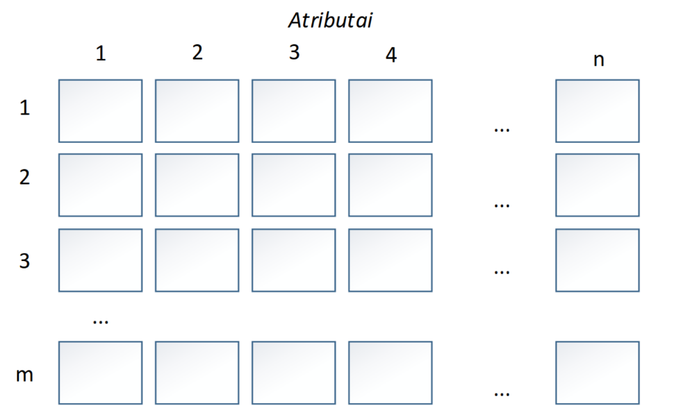
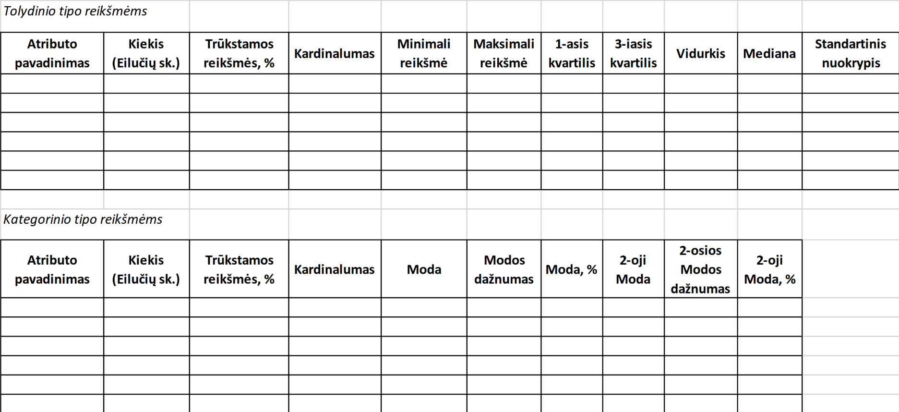
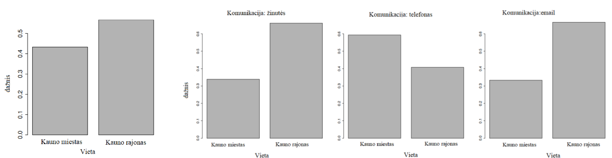

# Laboratorinis darbas Nr.1. Duomenų apdorojimas ir analizė

1. Pasirinkti (susikurti) duomenų rinkinį, su kuriuo atliksite šį bei sekančius laboratorinius darbus. Jūsų pasirinkimą turi patvirtinti vienas iš laboratorinių darbų dėstytojų.

Duomenų rinkinio reikalavimai:
* Turi egzistuoti skaitinės (_integer_ ir _real_ tipo) ir/arba kategorinės reikšmės. Duomenų rinkinys kuriame yra tik kategorinio tipo atributai **yra netinkamas**.
* Duomenų rinkinyje įrašų (eilučių) _m_ turi būti ne mažiau nei 500, t.y., $\infty > m \geq 500$ ir atributų _n_ nemažiau nei 8 (stulpeliai) $\infty > n \geq 8$. Jeigu atributų _n_ pasirinktame duomenų rinkinyje yra mažiau, privalote pridėti išvestinius (sukurtus) atributus (žr. pav. 1.)

__Svarbu.__ Sekančios užduotys turi būti realizuotos programiškai naudojant _Python_.

2. Atlikti duomenų rinkinio kokybės analizę (žr. 2 pav.). Kiekvienam **tolydinio** tipo atributui paskaičiuoti:
* bendrą reikšmių skaičių,
* trūkstamų reikšmių procentą,
* kardinalumą (**kardinalumas** matematikoje yra aibės savybė, apibendrinanti baigtinės aibės narių kiekio sąvoką. Papraščiau tariant kiek yra skirtingų atributo reikšmių. Pavyzdžiui lyties atributo kardinalumas lygus 2 - t.y., lytis gali turėti tik dvi reikšmes),
* minimalią (_min_) ir maksimalią (_max_) reikšmes,
* 1-ąją ir 3-iąją kvartilius (žr. 2 paskaitą, 37 skaidrę),
* vidurkį (žr. 2 paskaitą, 36 skaidrę),
* medianą (žr. 2 paskaitą, 36 skaidrę),
* standartinį nuokrypį (žr. 2 paskaitą, 36 skaidrę).

3. Kiekvienam **kategorinio** tipo atributui paskaičiuoti:
* bendrą reikšmių skaičių,
* trūkstamų reikšmių procentą,
* kardinalumą,
* modą (**moda** - vadinama dažniausiai pasitaikanti imties reikšmė) (žr. 2 paskaitą, 39 skaidrę),
* modos dažnumo reikšmę (žr. 2 paskaitą, 39 skaidrę).
* modos procentinę reikšmę (žr. 2 pasaitą, 39 skaidrę),
* 2-ąją modą (žr. 2 paskaita, 39 skaidrę),
* 2-osios modos dažnumo reikšmę (žr. 2 paskaitą, 39 skaidrę),
* 2-osios modos procentinę reikšmę (žr. 2 pasaitą, 39 skaidrę).

4. Nupaišyti atributų histogramas (rekomenduojamas stulpelių skaičius randamas formule: $1+3.22\log_{e}^{n}$, kur $n$ imties dydis). Ataskaitoje pateikti aprašymus, koks tai pasiskirstymas (pvz., _normalusis, vien(a)modalis, eksponentinis_ ir t.t.) ir kokias išvadas pagal tai galima formuluoti (žr. 2 paskaita, 41-43 skaidres).
5. Identifikuoti duomenų kokybės problemas: trūkstamas reikšmes, kardinalumo problemas, triukšmus - ekstremalias reikšmes (angl. _outliers_) (žr. 2 paskaita, 46-53 skaidres).
6. Pateikti šių problemų sprendimo planą, kuris bus realizuotas programiškai (pvz., bus įtraukiamos trūkstamos kategorinio atributo reikšmes remiantis atributo moda įverčiu, ekstremalios reikšmės yra šalinamos ar koreguojamos).
7. Nustatyti sąryšius tarp atributų panaudojant vizualizacijos būdus:
    * **Tolydinio tipo atributams**: naudojant „_scatter plot_“ tipo diagramą (žr. 3 paskaita, 5 skaidrė) pateikti kelis (2-3) pavyzdžius su stipria tiesine atributų priklausomybę (tiesioginė arba atvirkštinė koreliacija) bei kelis pavyzdžius su tarpusavyje nekoreliuojančiais (silpnai koreliuojančiais) atributais. Pakomentuoti rezultatus.
    * Pateikti SPLOM diagramą (Scatter Plot Matrix) (žr. 3 paskaita, 6 skaidrė).
    * **Kategorinio tipo atributams**: naudojant „bar plot“ tipo diagramą pateikti keletą (2-3) atributų priklausomybės pavyzdžių ir pakomentuoti rezultatus (žr. 3 paskaita, 7-9 skaidres).
    * Pateikti keletą (2-3) histogramų (žr. 3 paskaita, 12-14 skaidres) ir „box plot“ diagramų pavyzdžių (žr. 3 paskaita, 15 skaidrę), vaizduojančių sąryšius tarp **kategorinio** (pavyzdys pateiktas pav.3) ir **tolydinio** tipo kintamųjų.
8. Paskaičiuoti kovariacijos ir koreliacijos reikšmes tarp tolydinio tipo atributų ir grafiškai atvaizduoti koreliacijos matricą (žr. 3 paskaita, 24-34 skaidres). Rezultatus pakomentuoti.
9. Atlikti duomenų normalizaciją ( rėžiai [0;1] arba [-1;1]) (žr. 3 paskaita, 35-37 skaidres).
10. Kategorinio tipo kintamuosius paversti į tolydinio tipo kintamuosius.
