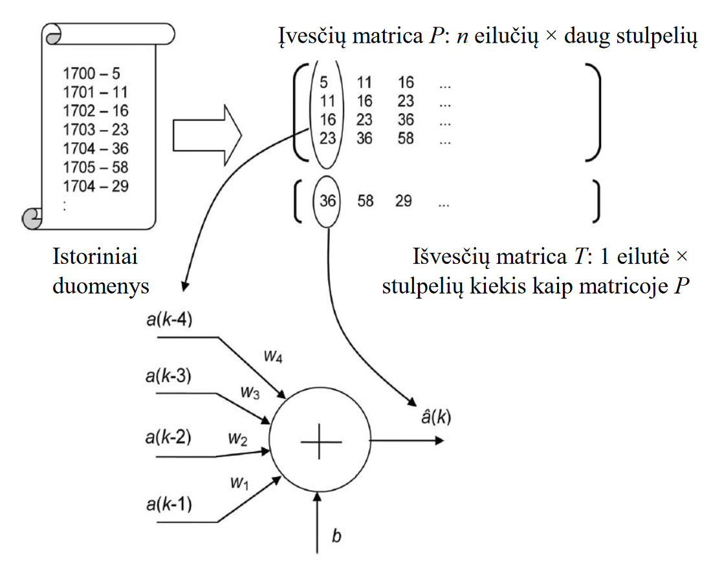

# Laboratorinis darbas 3-1 (pirma dalis)

## Tikslai

Susipažinti su prognozavimo uždavinio sprendimu panaudojant tiesinį dirbtinį neuroną, susipažinti su neuroninio tinklo mokymosi, testavimo ir jų panaudojimo uždaviniais.

## Darbo aprašas

Darbo metu bus panaudotas paprasčiausios struktūros dirbtinis neuroninis tinklas - vienetinis neuronas su tiesine aktyvavimo funkcija `(purelin(n)=purelin(Wp+b)=Wp+b)`. Neurono užduotimi bus laiko eilutės k-osios reikšmės a(k) prognozavimas panaudojant n ankstesnes reikšmes `a(k-1), a(k-2), ..., a(k-n)`. Modelį, kurį realizuojame esant prielaidai, kad priklausomybė tarp prognozuojamos reikšmės ir prieš tai esančių eilės elementų gali būti aprašyta naudojant tiesinę funkciją, vadiname autoregresiniu tiesiniu modeliu n-tosios eilės.

Tiesinės autoregresijos modelio išraiška turi šią formą:
$$\hat{a}(k)=w_1*a(k-1)+w_2*a(k-2)+...+w_n*a(k-n)+b$$

čia $w_1,w_2,w_n$ ir $b$ yra modelio parametrai ir $\hat{a}(k)$ pažymi sekančia eilės prognozuojamą reikšmę. Mūsų darbe autoregresinio modelio vaidmenį atliks dirbtinis neuronas, į kurio įėjimus padavinėsime prieš tai buvusias eilės reikšmes, modelio parametrų vaidmenį atliks šio neurono svoriniai koeficientai, o prognozuojama reikšmė pasirodys tik neurono išėjime. Išraišką 1.1 galime perrašyti:

$$a(k)=w_1*a(k-1)+w_2*a(k-2)+...+w_n*a(k-n)+b+e(k)$$

čia $e(k)=a(k)-\hat{a}(k)$ yra prognozavimo klaida k-tajame laiko žingsnyje.

Turint istorinių duomenų rinkinį ieškosime optimalias autoregresinio modelio parametrų reikšmes. Tai reiškia, kad sieksime, kad $\hat{a}(k)$ prognozė, sugeneruota mūsų modelio pagalba, mažiausiai skirtųsi nuo tikrosios $a(k)$ reikšmės, t.y. kad prognozės klaidų kvadratų suma $e(k)$ būtų mažiausia visam duomenų rinkiniui. Tuomet sukurtą modelį bus galima naudoti sekančioms reikšmėms prognozuoti.

Šiame darbe bus prognozuojamas saulės dėmių aktyvumas, išreikštas saulėje stebimų dėmių kiekiu tam tikrais kalendoriniais metais. Šis aktyvumas turi 11 metų cikliškumą.

Panaudojant istorinius duomenis, kurios aprašo saulės dėmių aktyvumą, pirmiausia aprašysime įvesties duomenis, kurie paduodami į neurono įėjimus, o taip pat išvesties duomenis. Taip pat duomenų rinkinį padalinsime į mokymosi ir testavimo dalis.

Toliau atliksime modelio svorio koeficientų optimalių reikšmių parinkimo procedūrą. Tiesinio neurono atveju tai galima atlikti dviem būdais: tiesiogiai apskaičiuojant panaudojant lygčių sistemą arba panaudojant iteracinį metodą, t.y. neurono mokymasis panaudojant mokymąsi su mokytoju. Apskaičiavus svorio koeficientus, bus atlikta modelio verifikacija, kurios tikslas patikrinti prognozavimo kokybę.

## Darbo eiga

1. Atsisiųsti `sunspot.txt`. Faile pateikti duomenys apie saulės dėmių aktyvumą nuo 1700 iki 2014 metų.
2. Užkrauti failo turinį į darbinę atmintį.
3. Patikrinti ar užkrauta atitinkama matrica - pirmas stulpelis atitinka metus, antras - saulės dienų aktyvumą.
4. Pirma užduotis, kurią turi realizuoti mūsų programa - nubrėžti saulės dėmių aktyvumo už 1700-2014 metus grafiką. Grafikas turi būti pilnai aprašytas - pateikti ašių ir grafiko pavadinimus.
5. Priimkime, kad autoregresinio modelio eilė bus lygi 2 (n=2). T.y. priimame, kad sekančių metų dėmių prognozė yra įmanoma turint tik dviejų ankstesnių metų dėmių skaičių. Tuomet neuronas turės tik du įėjimus. Papildykite scenarijų, aprašant matricas `P` ir `T`, kuriose atitinkamai pateikiami (mokymosi) įvesties duomenys o taip pat išvesties duomenys.
6. Nubrėžti trimatę diagramą, joje vaizduojant įvesties ir išvesties duomenis `P` ir `T` atitinkamai. Išanalizuoti gautą grafiką - sukiokite kol nepamatysite koreliacijos tarp duomenų požymius. Kokia yra neurono svorio koeficientų `w1`, `w2` ir `b` optimalių reikšmių parinkimo grafinė interpretacija? Pridėti ašių ir grafiko pavadinimus.
7. Išskirkime iš įvesties `P` ir išvesties `T` duomenų rinkinių fragmentus, turinčius po 200 pradžioje esamų duomenų - taip vadinamą apmokymo duomenų rinkinį. Remiantis šiuo rinkiniu apskaičiuosime optimalias neurono svorio koeficientų reikšmes (autoregresinio modelio parametrus). Likę duomenys bus panaudoti modeliui verifikuoti. Tuomet, panaudojant jau esamas `P` ir `T` matricas, apibrėžkime dvi naujas - `Pu` ir `Tu`, kurios turės pirmus 200 duomenų.
8. Sukurkite tiesinės autoregresijos modelį panaudojant apmokymo duomenų matricas `Pu` ir `Tu`. Python mokomoji medžiaga pateikta adresu <https://realpython.com/linear-regression-in-python/>.
9. Pavaizduoti gautas koeficientų reikšmes
10. Sekančiame žingsnyje atliksime modelio verifikaciją - t.y. patikrinsime prognozavimo kokybę atliekant modelio veikimo imitaciją. Pradžioje tai atliksime su apmokymo duomenų rinkiniu, kuris buvo panaudotas svorio koeficientams apskaičiuoti.  
Tarkime, turime suprognozuoti salės dėmių aktyvumą 1702–1901 metais. Tuo tikslu padavinėsime į modelio įėjimus aktyvumo rinkinius tokiais metais: 1700 ir 1701, 1701 ir 1702, …, 1899 ir 1900. Tai galima atlikti automatizuotu būdu paduodant įvesties duomenis, esančius matricoje `Pu`. Pasėkoje gausime rezultatų vektorių `Tsu`, t.y. prognozuojamas aktyvumo reikšmes 1702–1901 metams.  
Kadangi turime tikrąsias dėmių aktyvumo reikšmes nagrinėjamu laiko periodu (`Tu`), jas galime patikrinti su prognozuojamomis reikšmėmis (`Tsu`). Gautame grafike vaizdavimai turi būti paženklinti skirtingomis spalvomis bei turėti legendą.  
Modelio verifikaciją taip pat atlikite su nematytu duomenų rinkiniu – testavimo rinkiniu, t.y. su duomenimis nuo 201 eilutės. Bei sukurkite analogiškus grafikus vaizduojant `Tu` ir `Tsu` reikšmes.
11. Sukurti prognozės klaidos vektorių `e`. Nubraižyti prognozės klaidos
grafiką. Aprašyti jo ašis ir suteikti pavadinimą.
12. Nubraižyti prognozės klaidų histogramą (`hist`). Ją pakomentuokite.
13. Remiantis (1.3) apskaičiuoti vidutinės kvadratinės prognozės klaidos reikšmę (ang. _Mean-Square-
Error, MSE_):  
$ MSE=\frac{1}{N} \sum_{k=1}^{N}(a(k)-\hat{a}(k))^2=\frac{1}{N} \sum_{k=1}^{N}e(k)^2$  
Šiame darbe MSE įvertis neturi viršyti 300.  
Apskaičiuokite prognozės absoliutaus nuokrypio medianą (ang. _Median Absolute Deviation_)  
$ MAD = median(|a(k) - \hat{a}(k)|) $  
Palyginkite skirtumus tarp MSE ir MAD įverčių ir pakomentuokite.  
Sekančiuose punktuose sukurto scenarijaus tekstą modifikuosime, kad modelio svorio koeficientai būtų skaičiuojami iteraciniu metodu - atliekant neurono apmokymo procedūrą.
14. Scenarijų išsaugokite nauju vardu (padarykite sukurtos programos kopiją). Eksperimento būdu parinkite mokymosi greičio `lr` reikšmę (0<`lr`<=1). Parenkama reikšmė (pvz. 0.1), ji naudojama modelyje (žr. sekantį žingsnį). Jei modelis nekonverguoja, parinkta reikšmė mažinama (pvz. 10 kartų) ir procesas kartojamas kol modelis nepradės konverguoti.
15. Panaudojant aprašą pateiktą adresu <https://www.bogotobogo.com/python/scikit-learn/Single-Layer-Neural-Network-Adaptive-Linear-Neuron.php> sukurti tiesinį neuroną.
16. Apibrėžti siekiamą mokymosi klaidos MSE reikšmę (ang. _error goal_) intervale 150 – 300 ir maksimalų epochų kiekį (pvz. 1000). (Pastaba. Vienos epochos metu modelis panaudoja visą duomenų rinkinį. Vienos iteracijos metu modelis panaudoja tik vieną duomenų rinkinio eilutę.)
17. Įvykdyti modelį. Atspausdinti gautas po apmokymo svorio koeficientų reikšmes. Jas palyginti su gautais 9 žingsnyje.
18. Papildomai prie užduotų darbo metu klausimų, atsakykite raštu ir šiuos klausimus:
    * Ar mokymosi procesas yra konverguojantis? Jeigu ne, pamąstyti kas gali būti priežastimi ir pakeisti atitinkamą parametrą.
    * Kokios yra naujos neurono svorių koeficientų reikšmės?
    * Kokia yra neurono darbo kokybės įverčio MSE ir MAD reikšmės?
19. Procedūrą pakartoti kitoms 17 punkto parametrų reikšmėms. Ištirti jų reikšmės įtaką į mokymosi proceso eigą ir prognozavimo kokybę. Kokia yra maksimali leistina mokymosi proceso greičio koeficiento `lr` reikšmė, kuri užtikrina proceso konvergenciją?
20. Darbą atlikome priimant pradžioje pasiūlytą mūsų modelio struktūrą – sekančios reikšmės prognozavimas atliekamas remiantis dviejų ankstesniųjų metų duomenimis (t.y. modelio eilė n=2). Tiesinės autoregresijos ir tiesinio neurono modelių scenarijus pakoreguoti tokiu būdu, kad prognozė remtųsi didesniu nei anksčiau duomenų kiekiu – kai n=6 ir kai n=10. Tuo tikslu reikės atitinkamai modifikuoti matricų `P` ir `T` apibrėžimus. Ištirti (grafiškai ir pakomentuojant raštu) modelio struktūros keitimo įtaką į prognozavimo kokybę.

**Darbo ataskaitoje pateikti: scenarijų programos kodą su komentarais, sukurtus grafikus, klausymų atsakymus bei atliktų tyrimų rezultatus su pakomentavimu.**

# Laboratorinis darbas 3-2 (antra dalis)

## Tikslas

Pritaikyti įgytas žinias kuriant modelį prognozavimo ar klasifikacijos uždaviniui spręsti
naudojant 1 laboratorinio darbo duomenų rinkinį.

## Darbo eiga

1. Pasirinkite tikslo atributą iš 1 laboratorinio darbo duomenų rinkinio (jei tikslo atributas nebuvo apibrėžtas). (Pastaba: pavyzdžiui, banko klientų duomenų rinkinyje tikslo atributu gali būti laikomi kliento mokumo lygis arba kredito reitingas, filmų duomenų rinkinyje tikslo atributu gali būti sugeneruotas pelnas).
2. Jei reikia, atlikite tikslinių atributų reikšmių pertvarkymus (pvz., platus skaitinių atributų verčių diapazonas keičiamas mažesniu (kategorinių) intervalų skaičiumi (pvz., prognozuojamų reikšmių diapazoną 1..2000 galima pakeisti 1...5 intervalais).
3. Sukurkite reikšmės prognozavimo ar klasifikacijos modelį. Python mokomoji medžiaga pateikta
adresu <https://iamtrask.github.io/2015/07/12/basic-python-network/>
4. Įvertinkite sukurto modelio vidutinį tikslumo įvertį, taikant 10 intervalų kryžminės patikros metodą.
5. Pritaikykite bet kurią iš priemonių (pavyzdžiai pateikiami žemiau), kad padidintumėte vidutinį tikslumą bent 5 procentais ir pakartokite 4-ą darbo eigos žingsnį:
    * Pertvarkyti duomenų rinkinį,
    * Pakeiskite mokymosi greitį,
    * Pakeiskite aktyvacijos funkciją,
    * Pakeisti dirbtinio neuronų tinklo (DNT) struktūrą.

3-2 darbo dalies ataskaitoje pateikti:

1. Pradinio duomenų rinkinio aprašymas (žr. 1 laboratorinio darbo aprašo 2 paveiksle pateiktą lentelę).
2. Duomenų rinkinio pertvarkymų aprašas (jei buvo daryta)
3. DNT architektūros schema, kurioje matytųsi sluoksnių ir neuronų skaičius, įskaitant parametrų
vertes (mokymosi greitis, aktyvavimo funkcija)
4. 10 intervalų kryžminės patikros eksperimentų rezultatai (sąnaudų funkcijos vertė kiekviename intervale, vidutinė vertė).
5. Priemonių, kurių buvo imtasi siekiant pagerinti DNT veiklą, aprašymas.
6. 10 intervalų kryžminės patikros eksperimentų rezultatai (sąnaudų funkcijos vertė kiekviename
intervale, vidutinė vertė), kad iliustruoti atliktų DNT pokyčių efektyvumą.
7. Išvados.
